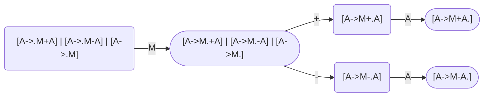

# Grammar

The grammar for the calculator. It is segmented into two parts: 
1. **Regular Grammar** for the Lexer
2. **Context-free Grammar** for the Parser

## Lexer Grammar

```regexp
 ID: \d+
OBR: (
CBR: )
 OP: \*|/|^|-|\+
```

### Lexer DFA


## Parser Grammar

```
S -> A
A -> M + A | M - A | M
M -> G * M | G / M | G
G -> P ^ G | P
P -> ( A ) | ID
```

Die Grammatik ist eindeutig und nicht linksrekursiv. Außerdem hat sie eine weitere interessante
Eigenschaft: 
Wenn die Grammatik mehrere Potenzen parsed, expandieren diese nach rechts. Beispiel: 
```
S
A
M
G
P  ^ G
ID ^ G
ID ^  P  ^  G
ID ^  ID ^  G
ID ^  ID ^  P  ^  G
ID ^  ID ^  ID ^  ID 
5  ^  4  ^  3  ^  2
```

Dabei sieht der Syntax Tree so aus: 
```
S
|
A
|
M
|
G
| \
P  G
|  | \ 
5  P  G
   |  | \ 
   4  P  G
      |  |
      3  P
         |
         2
```
Wenn also per Recursive Descent immer zuerst das "tiefste" Ergebnis ausgewertet wird, heißt
5^4^3^2 5^(4^(3^(2))), ohne weitere Berechnungen auszuführen.





